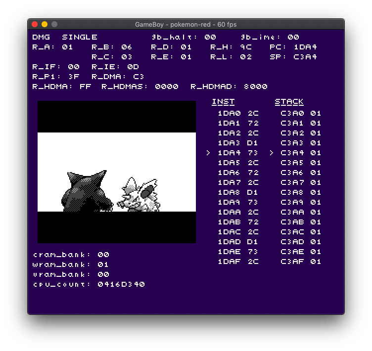

# Greg's GameBoy Emulator

This is a GameBoy emulator written in C. It has a dependency on SDL 2.

Under the JS directory, there is also a JavaScript implementation.

If you need information for developing your own emulator, read [Everything You Always Wanted To Know About GAMEBOY](http://gbdev.gg8.se/files/docs/mirrors/pandocs.html).

The software is available under the UNLICENSE.

## News

* Limited Sound Support
* Supports Pokémon Gold/Silver color mode
* WIP for CGB Support
* Interactive debugging

## Controls

* Arrow keys for D-Pad
* Z and X for AB buttons
* Enter and Shift for Start and Select
* Ctrl + Q to quit
* R, G, B, O, Y keys to change DMG color scheme
* 1, 2, 3, 9 to set 1x, 2x, 3x, and unlimited frameskip
* GamePad support may or may not work

## Debugger

Press F5 to toggle the debugger view on or off.

When debugger view is open, press P to toggle pausing or running the game.

When paused, press N to step through one operation.

